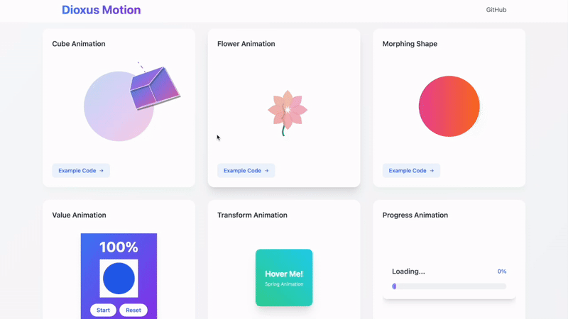

# Dioxus Motion 🚀

[](https://github.com/wheregmis/dioxus-motion/blob/main/LICENSE)
[](https://crates.io/crates/dioxus-motion)
[](https://docs.rs/dioxus-motion/0.1.4/dioxus_motion/)

A lightweight, cross-platform animation library for Dioxus, designed to bring smooth, flexible animations to your Rust web, desktop, and mobile applications.

## ⚠️ Important Note

This repository follows Dioxus's main branch for the latest features and improvements. For production use, we recommend using the stable version from [crates.io](https://crates.io/crates/dioxus-motion) instead of directly depending on the repository.

```toml
# Recommended: Stable version from crates.io
dioxus-motion = "0.3.1"

# Development version: Follows Dioxus main branch
dioxus-motion = { git = "https://github.com/wheregmis/dioxus-motion.git", branch = "main" }
```

## 🎯 Live Examples



Visit our [Example Website](https://wheregmis.github.io/dioxus-motion/) to see these animations in action:

## 🚀 Page Transitions

```rust
use dioxus_motion::prelude::*;

#[derive(Routable, Clone, Debug, PartialEq, MotionTransitions )]
#[rustfmt::skip]
enum Route {
    #[layout(NavBar)]
        #[route("/")]
        #[transition(Fade)]
        Home {},
        #[route("/slide-left")]
        #[transition(ZoomIn)]
        SlideLeft {},
        #[route("/slide-right")]
        SlideRight {},
        #[route("/slide-up")]
        SlideUp {},
        #[route("/slide-down")]
        SlideDown {},
        #[route("/fade")]
        Fade {},
    #[end_layout]
    #[route("/:..route")]
    PageNotFound { route: Vec<String> },
}
```

And replace all your `Outlet::<Route> {}` with `AnimatedOutlet::<Route> {}` and place the layout containing OutletRouter on top with something like this

```rust
#[component]
fn NavBar() -> Element {
    rsx! {
        nav { id: "navbar take it",
            Link { to: Route::Home {}, "Home" }
            Link { to: Route::SlideLeft {}, "Blog" }
        }
        AnimatedOutlet::<Route> {}
    }
}
```

Each route can have its own transition effect:

- `Fade`: Smooth opacity transition
- `ZoomIn`: Scale and fade combination
- `SlideLeft`: Horizontal slide animation
- [And more!](https://github.com/wheregmis/dioxus-motion/blob/main/src/transitions/page_transitions.rs)
- Also, add transitions feature to support page transitions. [Example](https://github.com/wheregmis/animated_router/blob/main/src/main.rs) which was translated from router [example](https://github.com/DioxusLabs/dioxus/blob/main/examples/router.rs) of Dioxus. More detailed guide will be updated soon.

### Quick Value Animation Example

```rust
use dioxus_motion::prelude::*;

#[component]
fn PulseEffect() -> Element {
    let scale = use_motion(1.0f32);

    use_effect(move || {
        scale.animate_to(
            1.2,
            AnimationConfig::new(AnimationMode::Spring(Spring {
                stiffness: 100.0,
                damping: 5.0,
                mass: 0.5,
                velocity: 1.0
            }))
            .with_loop(LoopMode::Infinite)
        );
    });

    rsx! {
        div {
            class: "w-20 h-20 bg-blue-500 rounded-full",
            style: "transform: scale({scale.get_value()})"
        }
    }
}
```

### Animation Sequences Example

Chain multiple animations together with different configurations:

```rust
let scale = use_motion(1.0f32);

// Create a bouncy sequence
let sequence = AnimationSequence::new()
    .then(
        1.2, // Scale up
        AnimationConfig::new(AnimationMode::Spring(Spring {
            stiffness: 400.0,
            damping: 10.0,
            mass: 1.0,
            velocity: 5.0,
        }))
    )
    .then(
        0.8, // Scale down
        AnimationConfig::new(AnimationMode::Spring(Spring {
            stiffness: 300.0,
            damping: 15.0,
            mass: 1.0,
            velocity: -2.0,
        }))
    )
    .then(
        1.0, // Return to original
        AnimationConfig::new(AnimationMode::Spring(Spring::default()))
    );

// Start the sequence
scale.animate_sequence(sequence);
// Each step in the sequence can have its own timing, easing, and spring physics configuration. Sequences can also be looped or chained with other animations.
```

## ✨ Features

- **🔧 Simplified Animatable Trait**: Uses standard Rust operators (`+`, `-`, `*`) instead of custom methods
- **🌍 Cross-Platform Support**: Works on web, desktop, and mobile
- **⚙️ Flexible Animation Configuration**: Spring physics and tween animations
- **📊 Custom Easing Functions**: Built-in and custom easing support
- **🧩 Modular Feature Setup**: Choose only what you need
- **💡 Simple, Intuitive API**: Easy to learn and use
- **🎬 Page Transitions**: Smooth route transitions with the `transitions` feature

## 🛠 Installation

Add to your `Cargo.toml`:

```toml
[dependencies]
dioxus-motion = { version = "0.3.0", optional = true, default-features = false }

[features]
default = ["web"]
web = ["dioxus/web", "dioxus-motion/web"]
desktop = ["dioxus/desktop", "dioxus-motion/desktop"]
mobile = ["dioxus/mobile", "dioxus-motion/desktop"]
```

If you want to use page transiton dependency will look like,

```toml
[dependencies]
dioxus-motion = { version = "0.3.0", optional = true, default-features = false }

[features]
default = ["web"]
web = ["dioxus/web", "dioxus-motion/web", "dioxus-motion/transitions"]
desktop = [
    "dioxus/desktop",
    "dioxus-motion/desktop",
    "dioxus-motion/transitions",
]
mobile = ["dioxus/mobile", "dioxus-motion/desktop", "dioxus-motion/transitions"]
```

## 🌐 Platform Support

Choose the right feature for your platform:

- `web`: For web applications using WASM
- `desktop`: For desktop and mobile applications
- `default`: Web support (if no feature specified)

## 🚀 Quick Start

## 🎨 Creating Custom Animatable Types

The simplified `Animatable` trait makes it easy to create custom animatable types:

```rust
use dioxus_motion::prelude::*;

#[derive(Debug, Copy, Clone, PartialEq, Default)]
struct Point3D {
    x: f32,
    y: f32,
    z: f32,
}

// Implement standard Rust operator traits
impl std::ops::Add for Point3D {
    type Output = Self;
    fn add(self, other: Self) -> Self {
        Self {
            x: self.x + other.x,
            y: self.y + other.y,
            z: self.z + other.z,
        }
    }
}

impl std::ops::Sub for Point3D {
    type Output = Self;
    fn sub(self, other: Self) -> Self {
        Self {
            x: self.x - other.x,
            y: self.y - other.y,
            z: self.z - other.z,
        }
    }
}

impl std::ops::Mul<f32> for Point3D {
    type Output = Self;
    fn mul(self, factor: f32) -> Self {
        Self {
            x: self.x * factor,
            y: self.y * factor,
            z: self.z * factor,
        }
    }
}

// Implement Animatable with just two methods!
impl Animatable for Point3D {
    fn interpolate(&self, target: &Self, t: f32) -> Self {
        *self + (*target - *self) * t
    }
    
    fn magnitude(&self) -> f32 {
        (self.x * self.x + self.y * self.y + self.z * self.z).sqrt()
    }
}

// Now you can animate 3D points!
let mut position = use_motion(Point3D::default());
position.animate_to(
    Point3D { x: 10.0, y: 5.0, z: -2.0 },
    AnimationConfig::new(AnimationMode::Spring(Spring::default()))
);
```

**Previous vs. New Trait Complexity:**
- **Before**: 7 required methods (`zero`, `epsilon`, `magnitude`, `scale`, `add`, `sub`, `interpolate`)
- **After**: 2 required methods (`interpolate`, `magnitude`) + standard Rust operators
- **Result**: ~70% less boilerplate, more idiomatic Rust code!

## 🔄 Migration Guide (v0.3.0)

- No breaking changes to the existing APIs. Just minor exports might change so just import prelude::\* if anything breaks on import

```rust
use dioxus_motion::prelude::*;
```

## 🔄 Migration Guide (v0.2.0)

### Breaking Changes

- Combined `use_value_animation` and `use_transform_animation` into `use_motion`
- New animation configuration API
- Updated spring physics parameters
- Changed transform property names

### New Animation API

```rust
use dioxus_motion::prelude::*;

// Before (v0.1.x)
let mut motion = use_value_animation(Motion::new(0.0).to(100.0));

// After (v0.2.x)
let mut value = use_motion(0.0f32);
value.animate_to(
    100.0,
    AnimationConfig::new(AnimationMode::Tween(Tween {
        duration: Duration::from_secs(2),
        easing: easer::functions::Linear::ease_in_out,
    }))
);

// Before (v0.1.x)
let mut transform = use_transform_animation(Transform::default());

// After (v0.2.x)
let mut transform = use_motion(Transform::default());
transform.animate_to(
    Transform::new(100.0, 0.0, 1.2, 45.0),
    AnimationConfig::new(AnimationMode::Spring(Spring {
        stiffness: 100.0,
        damping: 10.0,
        mass: 1.0,
        ..Default::default()
    }))
);
```

### If you were using transform.get_style(), that function is removed to make the library more generic so I recommend building something like

```rust
    let transform = use_motion(Transform::default());

    let transform_style = use_memo(move || {
        format!(
            "transform: translate({}px, {}px) scale({}) rotate({}deg);",
            transform.get_value().x,
            transform.get_value().y,
            transform.get_value().scale,
            transform.get_value().rotation * 180.0 / std::f32::consts::PI
        )
    });

    // and using the memo in the component
      rsx! {
        div {
            class: "...",
            style: "{transform_style.read()}",
            // ...rest of component...
        }
    }
```

## 🆕 New Features

### Loop Modes

```rust
.with_loop(LoopMode::Infinite)
.with_loop(LoopMode::Times(3))
```

### Animation Delays

```rust
.with_delay(Duration::from_secs(1))
```

### On Complete

```rust
.with_on_complete(|| println!("Animation complete!"))
```

## 🎓 Advanced Guide: Extending Animations

### Implementing the Animatable Trait

[Cube Component Example](https://github.com/wheregmis/dioxus-motion/blob/main/docs/src/old_showcase/components/cube_animation.rs)

The `Animatable` trait allows you to animate any custom type.

Defination of Animatable Trait

```rust
pub trait Animatable: Copy + 'static {
    fn zero() -> Self;
    fn epsilon() -> f32;
    fn magnitude(&self) -> f32;
    fn scale(&self, factor: f32) -> Self;
    fn add(&self, other: &Self) -> Self;
    fn sub(&self, other: &Self) -> Self;
    fn interpolate(&self, target: &Self, t: f32) -> Self;
}

```

Here's how to implement it:

### Custom Position Type

```rust
#[derive(Debug, Copy, Clone)]
struct Position {
    x: f32,
    y: f32,
}

impl Animatable for Position {
    fn zero() -> Self {
        Position { x: 0.0, y: 0.0 }
    }

    fn epsilon() -> f32 {
        0.001
    }

    fn magnitude(&self) -> f32 {
        (self.x * self.x + self.y * self.y).sqrt()
    }

    fn scale(&self, factor: f32) -> Self {
        Position {
            x: self.x * factor,
            y: self.y * factor,
        }
    }

    fn add(&self, other: &Self) -> Self {
        Position {
            x: self.x + other.x,
            y: self.y + other.y,
        }
    }

    fn sub(&self, other: &Self) -> Self {
        Position {
            x: self.x - other.x,
            y: self.y - other.y,
        }
    }

    fn interpolate(&self, target: &Self, t: f32) -> Self {
        Position {
            x: self.x + (target.x - self.x) * t,
            y: self.y + (target.y - self.y) * t,
        }
    }
}
```

### Best Practices

- Zero State: Implement zero() as your type's neutral state
- Epsilon: Choose a small value (~0.001) for animation completion checks
- Magnitude: Return the square root of sum of squares for vector types
- Scale: Multiply all components by the factor
- Add/Sub: Implement component-wise addition/subtraction
- Interpolate: Use linear interpolation for smooth transitions

### Common Patterns

#### Circular Values (e.g., angles)

```rust
fn interpolate(&self, target: &Self, t: f32) -> Self {
    let mut diff = target.angle - self.angle;
    // Ensure shortest path
    if diff > PI { diff -= 2.0 * PI; }
    if diff < -PI { diff += 2.0 * PI; }
    Self { angle: self.angle + diff * t }
}
```

#### Normalized Values (e.g., colors)

```rust
fn scale(&self, factor: f32) -> Self {
    Self {
        value: (self.value * factor).clamp(0.0, 1.0)
    }
}
```

## 🌈 Supported Easing Functions

Leverages the `easer` crate, supporting:

- Linear
- Quadratic
- Cubic
- Quartic
- And more!

## 🤝 Contributing

1. Fork the repository
2. Create your feature branch
3. Commit changes
4. Push to the branch
5. Create a Pull Request

## 📄 License

MIT License

## 🐞 Reporting Issues

Please report issues on the GitHub repository with:

- Detailed description
- Minimal reproducible example
- Platform and feature configuration used

## 🌟 Motivation

Bringing elegant, performant motion animations to Rust's web and desktop ecosystems with minimal complexity.
